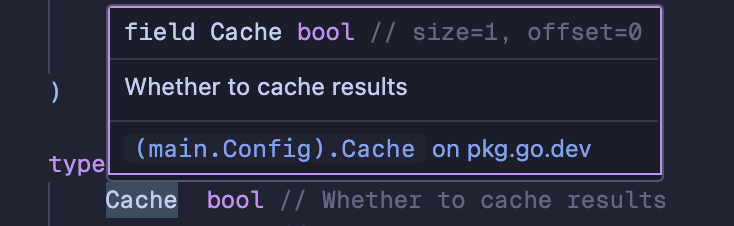


Dive into using Bitflags for lightning fast configuration and state management in Go


## The Pattern

You may have seen this sort of thing in Go code before:

At the top, a constant block using `iota`

```go
// Most often a uint, sometimes given a new type
type Something uint

const (
    FirstThing Something = 1 << iota
    SecondThing
    ThirdThing
    // ... more
)
```

Then it gets used somewhere, like in this struct for example

```go
type someStruct struct {
    // ... other stuff here
    flags Something // What?
}
```

And then further down you see something like:

```go
if s.flags&ThirdThing {
    // Do something...
}
```

In fact, this turns up *all over the place* in the Go standard library. Here's an example from [text/tabwriter]:

```go
// Formatting can be controlled with these flags.
const (
    // Ignore html tags and treat entities (starting with '&'
    // and ending in ';') as single characters (width = 1).
    FilterHTML uint = 1 << iota

    // Strip Escape characters bracketing escaped text segments
    // instead of passing them through unchanged with the text.
    StripEscape

    // Force right-alignment of cell content.
    // Default is left-alignment.
    AlignRight

    // Handle empty columns as if they were not present in
    // the input in the first place.
    DiscardEmptyColumns

    // Always use tabs for indentation columns (i.e., padding of
    // leading empty cells on the left) independent of padchar.
    TabIndent

    // Print a vertical bar ('|') between columns (after formatting).
    // Discarded columns appear as zero-width columns ("||").
    Debug
)

// ...snip

func (b *Writer) Init(output io.Writer, minwidth, tabwidth, padding int, padchar byte, flags uint) *Writer {
    // ...snip
    if padchar == '\t' {
        // tab padding enforces left-alignment
        flags &^= AlignRight
    }
    b.flags = flags

    b.reset()

    return b
}
```

And in [io/fs]...

```go
// A FileMode represents a file's mode and permission bits.
// The bits have the same definition on all systems, so that
// information about files can be moved from one system
// to another portably. Not all bits apply to all systems.
// The only required bit is [ModeDir] for directories.
type FileMode uint32

// The defined file mode bits are the most significant bits of the [FileMode].
// The nine least-significant bits are the standard Unix rwxrwxrwx permissions.
// The values of these bits should be considered part of the public API and
// may be used in wire protocols or disk representations: they must not be
// changed, although new bits might be added.
const (
    // The single letters are the abbreviations
    // used by the String method's formatting.
    ModeDir        FileMode = 1 << (32 - 1 - iota) // d: is a directory
    ModeAppend                                     // a: append-only
    ModeExclusive                                  // l: exclusive use
    ModeTemporary                                  // T: temporary file; Plan 9 only
    ModeSymlink                                    // L: symbolic link
    ModeDevice                                     // D: device file
    ModeNamedPipe                                  // p: named pipe (FIFO)
    ModeSocket                                     // S: Unix domain socket
    ModeSetuid                                     // u: setuid
    ModeSetgid                                     // g: setgid
    ModeCharDevice                                 // c: Unix character device, when ModeDevice is set
    ModeSticky                                     // t: sticky
    ModeIrregular                                  // ?: non-regular file; nothing else is known about this file

    // Mask for the type bits. For regular files, none will be set.
    ModeType = ModeDir | ModeSymlink | ModeNamedPipe | ModeSocket | ModeDevice | ModeCharDevice | ModeIrregular

    ModePerm FileMode = 0777 // Unix permission bits
)

// IsDir reports whether m describes a directory.
// That is, it tests for the [ModeDir] bit being set in m.
func (m FileMode) IsDir() bool {
    return m&ModeDir != 0
}
```

And you may be thinking...

> What do integers have to do with flags or configuration? How is `iota` involved? Why are we using bitshifting (`<<`)? And what do all these `&^=` operators do?

If you are, this post is for you!

## Powers of 2

In order to understand this pattern, we need to remember that computers speak binary. Everything is ultimately just ones and zeros under the hood:

- `1` is just `0001` in binary
- `2` is just `0010`
- `3` -> `0011`
- `4` -> `0100`

And so on... There are plenty of great explanations of binary on the internet so I won't do it to death here, hopefully you're following the basics!

Observe that powers of 2 (1, 2, 4, 8, 16, 32 etc.) have only a single `1` bit with the rest being `0`, but the location of this bit moves one slot to the left every time you increase the power of 2:

| Decimal | Binary     |
| ------- | ---------- |
| `1`     | `00000001` |
| `2`     | `00000010` |
| `4`     | `00000100` |
| `8`     | `00001000` |
| `16`    | `00010000` |
| `32`    | `00100000` |
| `64`    | `01000000` |
| `128`   | `10000000` |

## `iota`

In Go, we can express this easily as compile time constants using `iota`:

```go
package main

import "fmt"

const (
    one = 1 << iota
    two
    four
    eight
    sixteen
    thirtyTwo
    sixtyFour
    oneHundredAndTwentyEight
)

func main() {
    fmt.Printf("sixteen:\t%d\t%08b\n", sixteen, sixteen)
    fmt.Printf("thirtyTwo:\t%d\t%08b\n", thirtyTwo, thirtyTwo)
}
```

I've used `fmt.Printf` to output the number in both decimal (`%d`) and in binary, zero-padded to make up 8 bits (`%08b`)

Which outputs:

```plaintext
sixteen:    16  00010000
thirtyTwo:  32  00100000
```


The Go Wiki has a great page on `iota` here: <https://go.dev/wiki/Iota>


You can see the `1` moving (or shifting... 😏) one slot to the left. This is because `iota` will increment by 1 on every new constant in the block (starting from 0). And our
constant block above has `1 << iota` as the initial expression.

In other words, take the value of iota and left shift `1` (`00000001`) by that value. Here's a breakdown of what's really going on in the snippet above:

| Constant                   | `iota` | Effective Expression | Value (Decimal) | Value (Binary) |
| -------------------------- | ------ | -------------------- | --------------- | -------------- |
| `one`                      | `0`    | `1 << 0`             | `1`             | `00000001`     |
| `two`                      | `1`    | `1 << 1`             | `2`             | `00000010`     |
| `four`                     | `2`    | `1 << 2`             | `4`             | `00000100`     |
| `eight`                    | `3`    | `1 << 3`             | `8`             | `00001000`     |
| `sixteen`                  | `4`    | `1 << 4`             | `16`            | `00010000`     |
| `thirtyTwo`                | `5`    | `1 << 5`             | `32`            | `00100000`     |
| `sixtyFour`                | `6`    | `1 << 6`             | `64`            | `01000000`     |
| `oneHundredAndTwentyEight` | `7`    | `1 << 7`             | `128`           | `10000000`     |

You can see that `iota` just starts at zero, and increments by 1 every time there's a new constant in the block. On each new constant we're left shifting `1` by that new `iota`
amount, again starting from zero. So `one` is `1 << 0`, `two` is `1 << 1` and so on.

So we've actually already answered two of our questions from the top of the article!

> Why is iota involved? And why are we bitshifting to the left?

Because this is is an easy way of generating integers that are powers of two, especially when combined with Go's `iota` which lets us do this at compile time and give the
resulting constants helpful names. These binary integers differ only by a single bit, the position of which moves left by one slot on every power of two.

## Configuration

So how does this relate to configuration and state management? This power of two thing is cool but what do I actually use it for?

Well imagine you have a program that is configurable in some way, with toggles and switches that indicate that it should do one thing or another.

You might have a `Config` struct that looks a bit like this:

```go
type Config struct {
    Cache  bool // Whether to cache results
    Reset  bool // Controls whether to reset something after each run
    Debug  bool // Enable debug mode
    Secure bool // Whether to use a secure protocol
}
```

These are all meaningless in our imaginary program but you can see the pattern, lots of on/off switches represented as booleans. The code that uses this config will likely
have lots of things like this:

```go
if config.Reset {
    // Do the resetting
}

if config.Secure {
    // Use HTTPS
}
```

You may imagine that a `bool` might be implemented in computers as a single bit, `1` (on/true) or a `0` (off/false). But you'd be wrong! Hovering over the fields
of our `Config` struct in an editor that uses [gopls] reveals that a `bool` has a size of 1 byte (or 8 bits)



So thats 8x larger than the information it's expressing!


There are a lot of nerdy details behind why this is done which I encourage you to look into (<https://en.wikipedia.org/wiki/Data_structure_alignment>). But for now let's just say computers perform *a lot* better when things are aligned
in terms of bytes (8 bits). So even though bools contain only 1 bit of information, it's better to store them as 8 bits under the hood


And our `Config` struct has 4 of these, so for expressing 4 bits of information, we're using `4 * 8 bits = 32 bits` of space. Surely we can be more efficient than that? 🤔

Of course!

Recall our integer constants increasing in powers of two, and how each only has a single bit set to `1`, the position of which moves to the left in every increasing power of two.

What if we named our constants differently... and gave them a type...

```go
package main

import "fmt"

// Config holds configuration switches for our program.
type Config uint

const (
    Cache  Config = 1 << iota // Whether to cache results
    Reset                     // Control whether to reset something after each run
    Debug                     // Enable debug mode
    Secure                    // Whether to use a secure protocol
)

func main() {
    fmt.Printf("Cache:\t%d\t%08b\n", Cache, Cache)
    fmt.Printf("Reset:\t%d\t%08b\n", Reset, Reset)
    fmt.Printf("Debug:\t%d\t%08b\n", Debug, Debug)
    fmt.Printf("Secure:\t%d\t%08b\n", Secure, Secure)
}
```

This outputs:

```plaintext
Cache:  1   00000001
Reset:  2   00000010
Debug:  4   00000100
Secure: 8   00001000
```

Can you tell where we're going yet?

In this setup, it would be pretty easy to check if `Cache` was true, all we'd have to do is look at the right-most bit of the `uint` and check if it was `1` or `0`
(`true` or `false`). Likewise for `Reset`, we'd look at the second bit, from the right. `Debug`, the third bit... and so on.

Let's look at some examples to drive the point home:

- `00000001` -> `Cache == true`
- `00000010` -> `Reset == true`
- `00000011` -> `Cache == true && Reset == true`

So how do we express these states in actual Go code? We know how to do it in the struct approach:

```go
config := Config{
    Cache = true // Turn cache on
    Reset = true // And reset
}
```

But what about now using these numbers to encode our state? 🤔

Enter [bitwise operators]!

```go
// New blank config, uses the zero value for Config
// which is actually just a uint, so 0 or 00000000 in binary
var config Config

// Set Cache = true using bitwise OR (|)
// config is now 00000001
config = config | Cache

// Set Reset = true using OR again
// config is now 00000011
config = config | Reset

// Undo Reset using bitclear (AND NOT)
// config is now 00000001 again
config = config &^ Reset

// Check if cache is true
if config&Cache != 0 {
    // Yes it is!
}
```

You can see there's a 1:1 mapping between the struct/bool variant, and our uint variant. We can do all the same operations with our toggles:

- Combine them to form a group of settings (using bitwise OR `|`)
- Turn them off (using bitwise AND NOT `&^`)
- Check if one of them is set (using bitwise AND `&`)

## Why?

So why do it like this? Isn't the struct of bools clearer?

In a word... performance.

- The space required to store `n` booleans is now `n` bits rather than `n * 8` in the struct layout. This can add up!
- Modern computers are **really** fast at doing bitwise operations like this... like *really* fast
- The constants are just baked into your compiled program, so no memory allocation needed
- This pattern often results in better CPU cache locality than large structs, the entire `uint` can fit into a cache line most of the time

I also think it's quite a nice pattern once you get used to it and have seen it in the wild a few times, being able to compose settings at compile time is very useful. You
can even wrap the bitwise operator stuff in functions and methods to present a nicer API.

## Recap

We've now answered all of our questions from the top of the post! Hopefully this makes a bit more sense but let's have a quick recap before seeing a real example:

- Integers of increasing powers of two produce binary representations that differ by a single bit, the position of which moves left with each power of two
- The Go `iota` mechanism provides a nice way of generating such integers at compile time and giving them useful names
- By thinking of integers as this string of bits, we can efficiently store boolean information like configuration or state
- Bitwise operators can act on this representation and tell us which bits (settings) are set, and otherwise manipulate them
- Modern computers can do this *very* quickly and the data structure lends itself to high performance due to its small size and efficient operations

## A Real Example: Hue

Let's try and drive this home with an example from a real codebase.

I recently wrote `hue`, an ANSI terminal colour library for Go, it leverages all the patterns we've discussed above to be stupidly simple to use and significantly
faster than most of the alternatives.



### ANSI Colours

Before we look at bitflags, let's discuss ANSI colours briefly.

Terminal emulators (like iTerm2, terminal.app, ghostty etc.) do lots of weird and wonderful things to show us our command lines, one of which is interpreting [ANSI Escape Codes] in order
to show coloured text


There's a great summary of these codes [here](https://gist.github.com/fnky/458719343aabd01cfb17a3a4f7296797)


These codes work like this:

- Send the escape character `\x1b`
- Then a style code e.g. `[32`. Different colours and styles have different numbers
- Then `m` to mark the end of the start sequence
- Now print your string
- Then close the style with `\x1b[0m`, the "reset" code

```shell
# Print "Hello" in green (32)
echo "\x1b[32mHello\x1b[0m"
```

Each style has a different number associated to it, and you can combine arbitrary numbers together to compose a new style.

Hopefully this is triggering alarm bells after reading this far!? Lots of numbers... each one a unique style... can compose together... 🕵🏻‍♂️

### `hue.Style`

In hue, these codes are a new type `Style`

```go
type Style uint
```

And all the different supported styles are `1 << iota` constants forming integers in increasing powers of two!

```go
const (
    Bold    Style = 1 << iota
    Dim
    Italic
    Underline
    Reverse                          
    Hidden
    Strikethrough
    Black
    Red
    Green
    Yellow
    // More below...
)
```

So styles can be composed as compile time constants using [bitwise operators], just like we've seen above!

```go
const style = hue.Bold | hue.Cyan | hue.Underline
```

Annoyingly the ANSI codes aren't powers of two, so I turn these styles into [ANSI Escape Codes] using some of the stuff we've seen above. There's a big switch statement that maps these `Style`s to their ANSI code, here's a small snippet:

```go
switch s { //nolint: exhaustive // We actually don't want this one to be exhaustive
    case Bold:
    return "1", nil
    case Dim:
    return "2", nil
    case Italic:
    return "3", nil
    case Underline:
    return "4", nil
    case Reverse:
    return "7", nil
    case Hidden:
    return "8", nil
    case Strikethrough:
    return "9", nil
    // ... more
}
```

At the bottom of the switch I deal with combinations of styles (e.g. `hue.Bold | hue.Underline`) by:

- Iterating over the `Style`s I've declared (in increasing powers of two)
- Checking if the current style bit is set
- If so, include the associated ANSI code

```go
var styles []string

for style := Bold; style <= BrightWhiteBackground; style <<= 1 {
    // If the given style has this style bit set, add its code to the string
    if s&style != 0 {
        code, err := style.Code()
        if err != nil {
            return "", err
        }
        styles = append(styles, code)
    }
}

return strings.Join(styles, ";"), nil
```

And that's it!

## See Also

There's loads more you can do with this pattern. Some useful resources to take a look at if this interests you:

- <https://yourbasic.org/golang/bitmask-flag-set-clear/>
- <https://www.ardanlabs.com/blog/2021/04/using-bitmasks-in-go.html>

[text/tabwriter]: https://pkg.go.dev/text/tabwriter
[io/fs]: https://pkg.go.dev/io/fs
[gopls]: https://github.com/golang/tools/tree/master/gopls
[bitwise operators]: https://yourbasic.org/golang/bitwise-operator-cheat-sheet/
[ANSI Escape Codes]: https://en.wikipedia.org/wiki/ANSI_escape_code
