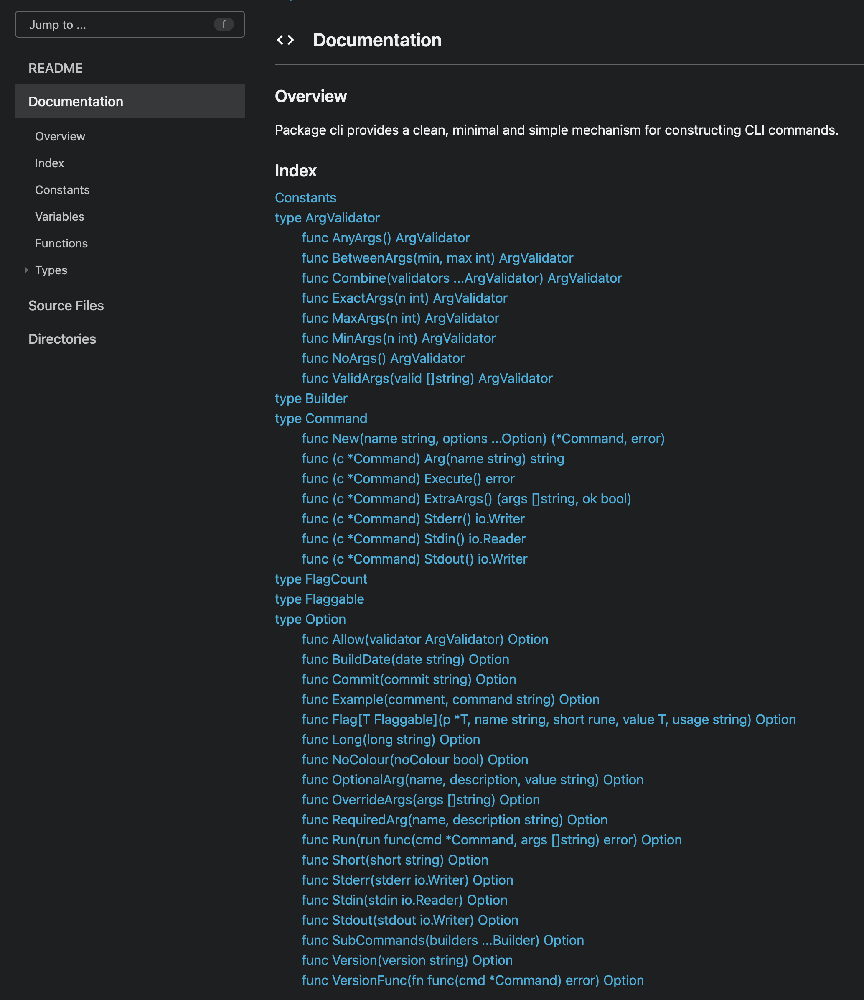

These AI generated header images are fun right? What's a "goctional option" 😂 Anyway...

## Brief Introduction

There's plenty of content out there on the functional options pattern for Go so the introductory explanation of the pattern will be brief. The pattern was popularised by
Dave Cheney in his post [Functional options for friendly APIs] and the **TL;DR** is:

Given a possibly complex struct `Thing` with lots of potential configuration and a `NewThing` style constructor... it's better for `NewThing` to take in 1 or more functions that set a single
piece of internal config, apply them all, then return the configured `Thing` (and possibly an error... I'll get to that later).

The primary advantages being:

- Adding a new piece of config is easy and not a breaking change
- Users can customise the behaviour of the type easily
- You don't have to have lots of arguments in your `New` function
- etc.

The canonical example is some web server:

```go
// Server is our HTTP server.
type Server struct {
    host     string
    logFile  string
    logLevel string
    port     int
    timeout  time.Duration
    debug    bool
    // ... and so on
}

// Option is a functional option for configuring a Server.
type Option func(*Server)

// WithTimeout sets the timeout.
func WithTimeout(timeout time.Duration) Option {
    // There is somewhat of a convention for naming your options
    // With<Thing>, your mileage may vary. I do it where it adds clarity
    // and omit it where it doesn't
    return func(s *Server) {
        s.timeout = timeout
    }
}

// Imagine all the others...

// New builds and returns a new Server, applying a number of options.
func New(host string, port int, options ...Option) *Server {
    // Things that are mandatory, require as explicit arguments.
    // Everything else should be options

    // The default implementation to return if no options are passed
    srv := &Server{
        host:       host,
        port:       port,
        logLevel:   "INFO",
        timeout:    3 * time.Second
    }

    for _, option := range options {
        option(srv)
    }

    return srv
}
```

Not that this is the perfect example of the power of the pattern but you'll see it everywhere so it's at least familiar!

Observe that the `Server` type is capitalised, meaning it's exported and can be called by users of your library, whereas the fields inside are not, they are private to your
implementation. The only means the user has of configuring a `Server` is via the `Option`.

This is exactly the point! Functional options provide users the ability to configure the objects in your library, without needing access to the internals.

### ⚠️ When to use Functional Options

Functional options is a pattern, and like *all* patterns it has use cases it's particularly well suited for, and other use cases it's not well suited for, or even is detrimental
to. The trick is applying it where it makes sense, and using something else where it doesn't.

Applying it too much is likely to result in additional complexity, loss of performance and unnecessary cognitive overhead. And never using it means you're missing out
on the power and flexibility it can provide in the right situations.

*Use common sense!* 🧠

✅ Functional options are often useful when:

- Creating or configuring a complex, behaviour-driven object that is expensive to initialise but cheap to use
- It's conceivable to create the object with no options and it's still useful, options merely specialise the object
- You want to hide internal implementation details but give users of your API access to change configuration in a controlled (possibly also validated) way
- You want to validate the options provided to ensure they are sane before applying them
- You know (or think it's likely) that your set of configuration will expand in the future and you want to retain the ability to add options without making breaking changes

❌ They are probably **not** best suited in the following cases:

- Configuring many small objects that are created and destroyed often
- A very performance sensitive application or when they are called in a very hot loop
- When the configuration needs are relatively simple or unlikely to change
- When usage of the API is highly locally contained e.g. in `internal` packages

Right, with that out of the way... Let's get to the meat of what I want to say here. I'd like to introduce 3 "levels" of the functional options pattern as well as discuss the
benefits and drawbacks, and provide guidance on when to use each.

## Level 1: The Infallible Option

We've actually seen level 1 already, in the `Server` example at the top of the post. The options are "infallible" because they do not return an error, they *only* mutate
the state of the object they are configuring.

We can see that easily in the signature:

```go
// Option is a functional option for configuring a Server.
type Option func(*Server)
```

An `Option` here is a function that takes in a pointer to a `Server` (so it can mutate it's internal state), and returns nothing, so it **cannot** fail.

This is our first hint at where this version of functional options should be used... in situations where applying the option **cannot** fail:

- The config it's setting is **always** valid, regardless of the value the user provides
- Any side effects of the option are infallible
- Applying the option with any arbitrary value will lead to **valid** behaviour of the object

My experience has been that there are surprisingly few applications for completely infallible options, *especially* in a public API where you could reasonably expect any
arbitrary values to be provided. Most of the time, you will want to return an error.

The closest I could come up with to a completely infallible option is a simple boolean toggle.

```go
// Debug sets debug mode on the Thing.
func Debug(enabled bool) Option {
    return func(thing *Thing) {
        thing.debug = enabled
    }
}
```

There are only 2 possible values a user could provide, and it's very difficult (although not impossible) to imagine anything exploding if `debug` is either `true` or `false`.

⚠️ Be careful though! You can get caught out.

One such example might be an option that sets a struct field that should never be less than zero.

```go
// WithCount sets the number of occurrences, in a log message
// ... or something like that
func WithCount(count uint) Option {
    return func(thing *Thing) {
        thing.count = count
    }
}
```

On the surface this looks safe right? It's *impossible* for people to provide a negative count, the compiler will enforce that because the type of `count` is `uint`.

But this can still fail if someone gives a pathologically high value for `count`, and you do some maths with it, causing it to overflow.

This admittedly is a ridiculous, pathological example but it's more to demonstrate the point that *truly* infallible options are incredibly rare in the wild and you should
probably do some validation and return an error from your options.

## Level 2: The Fallible Option

So what happens then if you're using "level 1" options, and someone gives you a bad input, or a particular combination of options are mutually exclusive or nonsensical?

Well you could `panic`... But well behaved libraries don't panic ❌

You could detect the invalid config and silently correct it to a more sensible value. Say if someone provided a pathologically high value to a `uint32` you could set
it to `0`, and silently return an object that is **not** what the user expected ❌

Or you could ignore the problem, do no validation and silently return a broken object ❌

We obviously won't be doing any of those! We are good Go engineers, we know what to do already. If something *can* fail, it *must* return an error. Enter the fallible option...

```go
// Level 1
type Option func(*Thing)
```

vs

```go
// Level 2
type Option func(*Thing) error
```

This seems such a tiny difference but it gives us a **huge** increase in expressive power. Now our options can:

- Validate user input and present that information back to the user in the form of an error
- Report other configuration errors e.g. mutually exclusive options
- Perform fallible transformations on user input before storing it in the struct

Consider a `WithTimeout` option on our `Server` now:

```go
// For whatever reason, we can't wait longer than this
const maxTimeout = 30 * time.Second

// WithTimeout sets the timeout.
func WithTimeout(timeout time.Duration) Option {
    return func(s *Server) error {
        if timeout > maxTimeout {
            return fmt.Errorf("timeout %v is too high, maximum timeout is %v", timeout, maxTimeout)
        }
        s.timeout = timeout
        return nil
    }
}
```

And the `New` function is almost identical, except for handling the error and returning it to the caller...

```go
// New builds and returns a new Server, applying a number of options.
func New(host string, port int, options ...Option) (*Server, error) {
    // Things that are mandatory, require as explicit arguments.
    // Everything else should be options

    // The default implementation to return if no options are passed
    srv := &Server{
        host:       host,
        port:       port,
        logLevel:   "INFO",
        timeout:    3 * time.Second
    }

    for _, option := range options {
        if err := option(srv); err != nil {
            return err
        }
    }

    return srv, nil
}
```

What would we have done without the ability to validate the user input, ensure that it remains within our supported constraints and report that back to the user?

There's also a neat trick to be had here! Let's say there are 5 functional options that return errors, and imagine the case where the user gave invalid input in all 5
of them. In our current setup, their application would fail with the first error, then they'd fix that, then it would fail with the second error, they'd fix that, then the 3rd
and so on...

This is a *terrible* user experience for your library, forcing your callers to play whack-an-error until they find the magic incantation that works. We can do better!

Using [errors.Join], you can bubble all the validation errors from applying the options up at once:

```go
// No more whack-an-error
var errs error
for _, option := range options {
    errs = errors.Join(errs, option(srv))
}

if errs != nil {
    return nil, errs
}
```

`errors.Join` discards nil errors so this trick also avoids the need to check. We just join up all the errors, and return them in one go to the user so they can fix *all* of their
issues in one go before retrying... a far nicer experience!


`errors.Join` concatenates the error messages with a `\n` so if you're outputting them to a terminal or file, they will show as a list of errors ✨


## Level 3: Complete Encapsulation

Honestly, level 2 is 90% of everything you'd ever need functional options to do and is a sensible default for most use cases where functional options are a good choice.

But, in certain situations, you might want to reach for level 3. Let me explain...

Our `Option` in level 2 took in a pointer to the `Thing` we were configuring:

```go
// Level 2
type Option func(*Thing) error
```

This works great, but there's a slight issue that might come up if you're trying to design bulletproof libraries, or you want to make very strong guarantees about
the validity of the types you provide.

Both `Thing` and `Option` are exported types, the user can call the `Option` on the `*Thing` *after* it's been returned from the `New` function, meaning it can
be modified after creation.

```go
thing := stuff.NewThing(
        stuff.WithTimeout(10 * time.Second),
        stuff.Debug(true),
        // etc...
    )

// We can take the thing later on, and run it back through the options
// in this case, turning debug mode off
stuff.Debug(false)(thing)
```

90% of the time this is absolutely fine, people don't tend to do this. But they *can* and depending on the type of library you're building, this may or may not be okay. You
may want to guarantee that the object returned from `NewThing` is effectively immutable, once it's configured and returned it is impossible for the user to change:

- Your options might configure low level concurrency primitives that must not be changed once the object has been returned as doing so might create a race condition
- You don't know when the caller might run your object back through an `Option`, doing so after a certain operation has been started could be a bug
- If your object is designed to be used across goroutines, ensuring immutability is desirable as it eliminates some synchronisation requirements
- You just want to give strong guarantees in your library about the state of the program

So let's see how we can do that!

It starts with the `Option` type, instead of it being a function, we now make it an `interface`:

```go
// Option is a functional option for configuring a Thing.
type Option interface {
    // Apply the option to the config, returning any error
    apply(cfg *config) error
}
```


Note that this is a *private* interface, the `apply` method is unexported, meaning only your library can implement it


We've also introduced a new type `config`, what's one of those? Well... it's basically an exact copy of the `Thing` you're configuring. If your `Thing` looks like this:

```go
type Thing struct {
    name        string
    debug       bool
    stdout      io.Writer
    logLevel    string
    // etc...
}
```

Then your `config` would be:

```go
type config struct {
    name        string
    debug       bool
    stdout      io.Writer
    logLevel    string
    // etc...
}
```

Why a copy? This is the trick that guarantees immutability. The `Option` acts on the `*config`, **not** the `*Thing`, meaning that once your `*Thing` is returned from `New`, so
long as it has only unexported fields, the user *cannot* modify it.

Again, this might not be necessary for most things, but if your use case requires it this is a good option. As always, use common sense 🧠

Anyway, let's continue...

We need a little more code to make this work properly:

```go
// optionFunc is a function adapter implementing the
// Option interface, analogous to how http.HandlerFunc
// implements http.Handler.
type optionFunc func(cfg *config) error

// apply applies the option to the cfg, implementing
// the Option interface for an optionFunc by calling
// itself.
func (o optionFunc) apply(cfg *config) error {
    return o(cfg)
}
```

This is probably the weirdest bit to get your head around. Here we're declaring a new type `optionFunc` that implements our `Option` interface (it has an `apply` method with the
right signature).

So an `optionFunc` effectively calls *itself* to apply an option.

This adds a bit more code to the implementation of one of our options, let's consider the `WithTimeout` option again:

```go
// Still have a max limit.
const maxTimeout = 30 * time.Second

// WithTimeout sets the timeout for a Thing.
func WithTimeout(timeout time.Duration) Option {
    f := func(cfg *config) error {
        if timeout > maxTimeout {
            return fmt.Errorf("timeout %v is too high, maximum timeout is %v", timeout, maxTimeout)
        }

        cfg.timeout = timeout
        return nil
    }

    return optionFunc(f)
}
```

Here we declare a new function that fits the signature of `optionFunc`, do the option handling logic inside it including validation and errors. Then we cast this function to
an `optionFunc` an return it. The casting to an `optionFunc` is needed because then it gains the `apply` method, which is the thing we need to satisfy the `Option` interface.

Now let's take a look at `New` and how this is used:

```go
// New builds and returns a new Thing.
func New(name string, options ...Option) (*Thing, error) {
    // Default implementation to return if no options are passed
    cfg := config{
        name:     name,
        debug:    false,
        stdout:   os.Stdout,
        logLevel: "INFO",
        // etc...
    }

    // Apply the options
    var errs error
    for _, option := range options {
        errs = errors.Join(errs, option.apply(&cfg))
    }

    // Copy into the Thing and return it
    thing := &Thing{
        name:     cfg.name,
        debug:    cfg.debug,
        stdout:   cfg.stdout,
        logLevel: cfg.logLevel
        // etc...
    }

    return thing, nil
}
```

This should look familiar, with the exception of the bottom bit! Recall earlier we said with this pattern, the options operate on a *copy* of the object. This is why we need to
explicitly copy out all the fields at the end.

Once the `*Thing` is returned, it's effectively opaque and immutable to the user. Other than that, the pattern is the same as with level 2.

## Recap

Let's have a quick wash up before seeing a real example of how I've used this exact pattern in a recent project 🤓

- Functional options are a pattern in Go enabling API authors to provide flexible configuration to users without exposing internals
- They should be used carefully and in the right context, see [When to use Functional Options](#️-when-to-use-functional-options)
- In general, library authors should prefer fallible options to infallible ones as it provides the most flexibility and best user experience most of the time
- In certain situations, it may be beneficial to provide complete encapsulation of your type by using a private interface for your `Option`

## A Real Example: CLI

A lot of my side projects are command line apps, I don't know why I like building them so much... but I do!

The defacto standard for creating CLIs in Go is [spf13/cobra], which I used for many projects... it's great! And *seriously* battle tested, this thing powers some of the
most used CLIs on the planet.

But it's grown quite old, doesn't take advantage of some more modern Go features, and IMO is slightly creaking under the weight of expanding features. There are seemingly 3 or
4 ways of achieving the same thing in Cobra.

Over the tools I've used it for I've grown slightly frustrated with some of it's design choices:

- A command has 10... yes 10! ways of attaching a `Run` function
- It really irks me having to write `flag.StringSliceVarP` and all the other variants of flag types, we've had generics for a while now
- It kind of forces it's structure on your program, you have to make all these structs and combine them all together
- Complex commands can be a lot of boilerplate
- The `Command` struct has grown massive over the years, with all sorts of fields and features I have never needed
- The help text was driven by `text/template` which is relatively slow and causes [issues] with the compiler performing dead code elimination[^1]

So I did what any good nerd would do in this situation... wrote my own 😎



I had a few goals in mind:

- A very clean, very simple API with one and only one way of doing any given thing
- Flags **must** be generic, no more `BoolVarP`
- Stronger guarantees about internal command state
- Relatively opaque to the end user, with enough flexibility to do what they want to do
- Opinionated defaults, not infinite customisation

Over and above all that though was a phrase I'd heard multiple times in a number of talks and software publications:

> Good libraries are easy to use, but difficult to misuse

Given all that, I knew I wanted to use functional options to build up CLI commands, validating heavily and returning errors when things weren't right. I also wanted to
near-completely encapsulate the `Command` struct so I chose the [Level 3](#level-3-complete-encapsulation) approach.

Here is an `Option` in `cli`:

```go
// Option is a functional option for configuring a [Command].
type Option interface {
    // Apply the option to the config, returning an error if the
    // option cannot be applied for whatever reason.
    apply(cfg *config) error
}

// option is a function adapter implementing the Option interface, analogous
// to http.HandlerFunc.
type option func(cfg *config) error

// apply implements the Option interface for option.
func (o option) apply(cfg *config) error {
    return o(cfg)
}
```

Looks *very* familiar right? Almost like I ~stole~ used my actual code for the examples in this post 👀

Here is the `New` function that constructs a `Command`:

```go
// New builds and returns a new [Command].
//
// The command can be customised by passing in a number of options enabling you to
// do things like configure stderr and stdout, add or customise help or version output
// add subcommands and run functions etc.
//
// Without any options passed, the default implementation returns a [Command] with no subcommands,
// a -v/--version and a -h/--help flag, hooked up to [os.Stdin], [os.Stdout] and [os.Stderr]
// and accepting arbitrary positional arguments from [os.Args] (with the command path stripped, equivalent to os.Args[1:]).
//
// Options will validate their inputs where possible and return errors which will be bubbled up through New
// to aid debugging invalid configuration.
func New(name string, options ...Option) (*Command, error) {
    // Default implementation
    cfg := config{
        flags:        flag.NewSet(),
        stdin:        os.Stdin,
        stdout:       os.Stdout,
        stderr:       os.Stderr,
        args:         os.Args[1:],
        name:         name,
        version:      "dev",
        versionFunc:  defaultVersion,
        short:        "A placeholder for something cool",
        argValidator: AnyArgs(),
    }

    // Apply the options, gathering up all the validation errors
    // to report in one go
    var errs error
    for _, option := range options {
        errs = errors.Join(errs, option.apply(&cfg))
    }

    // Ensure we always have at least help and version flags
    err := Flag(&cfg.helpCalled, "help", 'h', false, "Show help for "+name).apply(&cfg)
    errs = errors.Join(errs, err) // nil errors are discarded in join

    err = Flag(&cfg.versionCalled, "version", 'V', false, "Show version info for "+name).apply(&cfg)
    errs = errors.Join(errs, err)

    if errs != nil {
        return nil, errs
    }

    // Additional validation that can't be done per-option
    // A command cannot have no subcommands and no run function, it must define one or the other
    if cfg.run == nil && len(cfg.subcommands) == 0 {
        return nil, fmt.Errorf(
            "command %s has no subcommands and no run function, a command must either be runnable or have subcommands",
            cfg.name,
        )
    }

    return cfg.build(), nil
}
```


`cfg.build()` at the end there just copies the `config` into the `Command`... in case you were wondering 😊


### Bonus: Documentation

A great bonus benefit that comes from using a private `interface` as your `Option` type is that in the go doc, all your options are nicely grouped underneath the interface:



So discoverability of your options (one of the criticisms of the pattern) is nicely addressed! Feel free to browse the [code] or the [go doc] for the project. It's still a work
in progress but I've been using it on all my CLI side projects for a while now and it works great!

[^1]: This is being fixed by the Cobra maintainers but at the time of writing is not yet released, see <https://github.com/spf13/cobra/pull/1956>

[Functional options for friendly APIs]: https://dave.cheney.net/2014/10/17/functional-options-for-friendly-apis
[errors.Join]: https://pkg.go.dev/errors#Join
[spf13/cobra]: https://github.com/spf13/cobra
[issues]: https://github.com/spf13/cobra/issues/2015
[code]: https://github.com/FollowTheProcess/cli
[go doc]: https://pkg.go.dev/github.com/FollowTheProcess/cli
