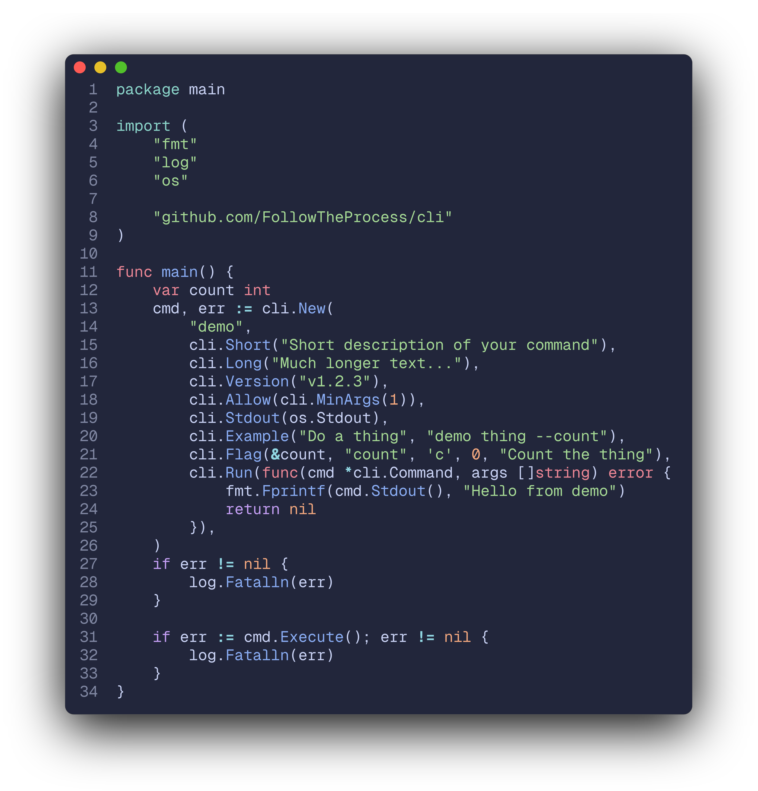

Super quick tip today 💡

I write a lot of CLI tools. I love the terminal and I like crafting little tools that I can use. I've even made a [library] to make this easier in Go!

One thing I find difficult however is sufficiently documenting your CLI, and showing it's behaviour in a way that grabs users and shows them why they want to use
your tool.

Enter [vhs] and [freeze]!


Both of these tools are written by [charmbracelet](https://github.com/charmbracelet), if you've not had a look through the projects they put out then you really should!


## VHS

VHS is a tool that lets you write some code, turn that into a gif, then save it (or host it) wherever you like.

It takes a description of the commands you want to run and some settings in a `.tape` file that looks like this:

```vhs
Output your.gif

Set FontSize 18
Set FontFamily "Geist Mono"
Set Theme "Catppuccin Macchiato"
Set WindowBar Colorful
Set Padding 5
Set Margin 40
Set MarginFill "#7983FF"
Set BorderRadius 10
Set TypingSpeed 100ms

Type "echo hello" Sleep 500ms  Enter

Sleep 2s

Type "clear" Sleep 500ms Enter

Sleep 1s
```

And gets you this...


I use [vhs] extensively to document my CLI examples:

- <https://github.com/FollowTheProcess/cli/tree/main/examples>
- <https://github.com/FollowTheProcess/hue>

And so do [charmbracelet], their docs are full of gifs done this exact same way!

- <https://github.com/charmbracelet/log>
- <https://github.com/charmbracelet/huh>
- <https://github.com/charmbracelet/vhs> (very meta!)

## Freeze

Another tool I find myself using is [freeze], which generates amazing looking images of code or shell command results. I find it particularly useful when I'm trying to document a library
and show how to do a particular thing.

I'll write the Go code in an example file, then use [freeze] to render a pretty image, and show *that* on the `README.md` for example.

Take this one, from [cli]:



And all you have to do generate that is:

```shell
freeze ./examples/cover/main.go --config ./docs/src/freeze.json --output ./docs/img/demo.png --show-line-numbers
```

The config is totally optional but I like to save things!

```json
{
  "background": "#171717",
  "border": {
    "color": "#515151",
    "radius": 8,
    "width": 1
  },
  "font": {
    "family": "Geist Mono",
    "ligatures": true,
    "size": 14
  },
  "line_height": 1.2,
  "margin": [
    50,
    60,
    70,
    60
  ],
  "padding": [
    5,
    15,
    5,
    5
  ],
  "shadow": {
    "blur": 24,
    "x": 0,
    "y": 12
  },
  "theme": "catppuccin-macchiato",
  "window": true
}
```

Go forth and use these tools to improve your docs!

[library]: https://github.com/FollowTheProcess/cli
[vhs]: https://github.com/charmbracelet/vhs
[freeze]: https://github.com/charmbracelet/freeze
[charmbracelet]: https://github.com/charmbracelet
[cli]: https://github.com/FollowTheProcess/cli
